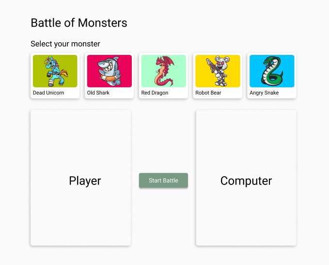
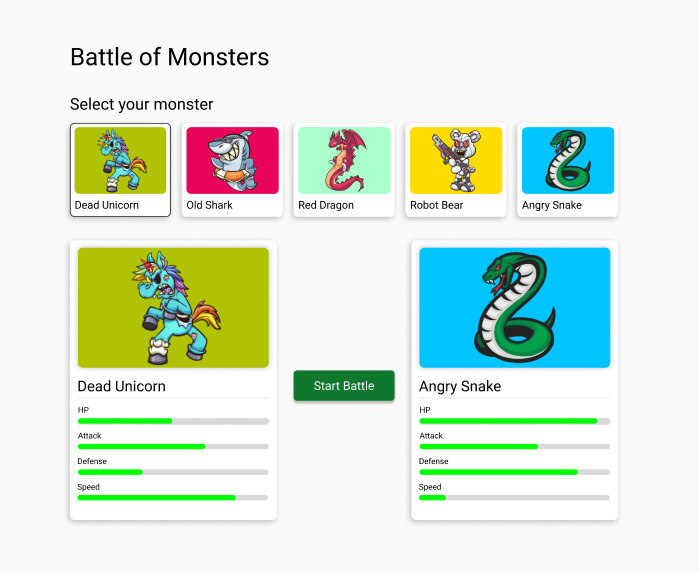
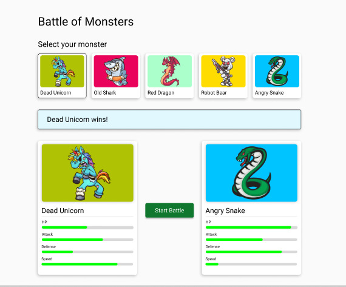

 </img>

# Angular Coding Challenge - Battle of Monsters

This is a Angular code challenge that I had to do to be vetted on the Angular framework. It had to be finished under 60 minutes and recorded with my commenting while coding.

> **Here is the video recording:**
[https://drive.google.com/file/d/1Bq5rZRe1mXVZ_P2lhGDyz1nbAkegXahd/view?usp=sharing](https://drive.google.com/file/d/1Bq5rZRe1mXVZ_P2lhGDyz1nbAkegXahd/view?usp=sharing)

## The coding challenge

**Goals**
* Create the monster's card component to visualize the monster's strengths and weaknesses correctly.
* Implement the logic to get the computer's monster which should be randomly selected after the player's monster is selected, not allowing it to be the same one as the player; remember that you will select the player's monster by clicking on it.
* Once both monsters are selected, the user can “Start Battle," and you must implement the service request and display the battle result correctly.

**Important Considerations**
* For "Start Battle" We already have an endpoint ready for it. You don't need to worry about the endpoint implementation or even the logic to calculate the monster's battle.
* It is not necessary to create a responsive application for different devices; you can focus only on the web version.

> We do not recommend you change any data of the API; your goal is to implement the challenge with the data already provided and running.

**Acceptance Criteria**
1. Implementation matches the design.
2. The computer monster is randomly selected after selecting the player monster.
3. The winner's message should be presented after the battle.
4. Tests pass, and coverage has been added to cover the changes and new implementations.

## Design
 </img>
 </img>
 </img>